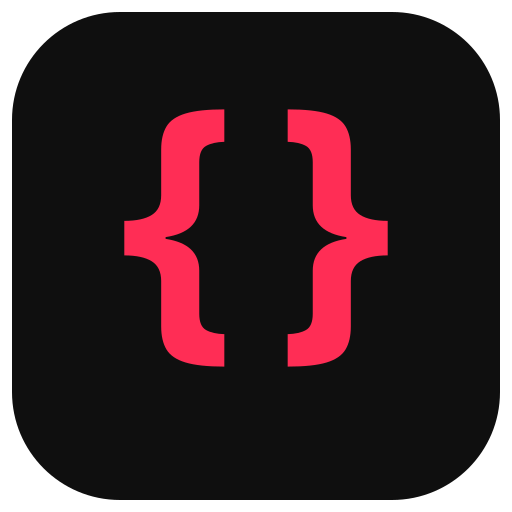
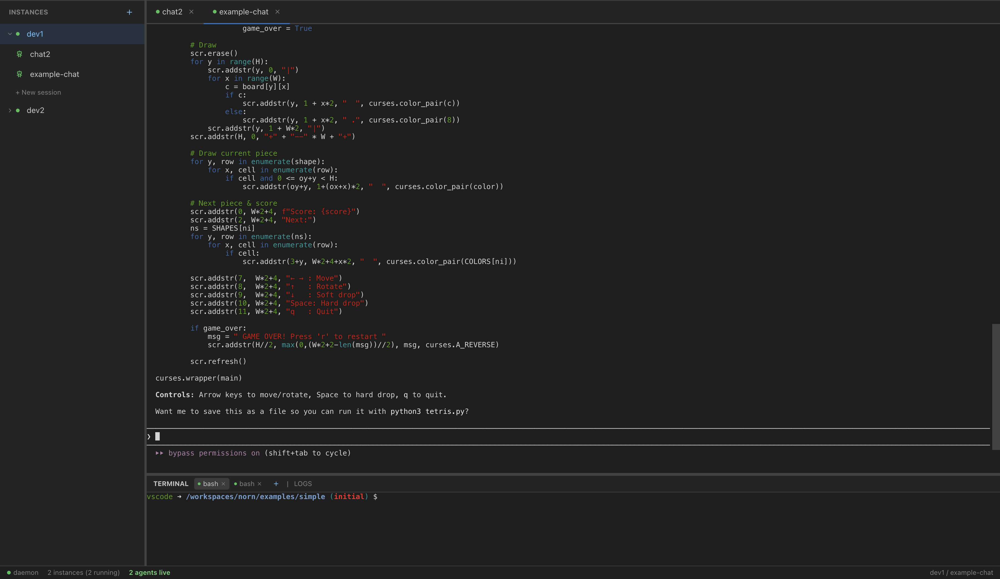

<h1>
    
    Norn
</h1>



## Features

- **Instance management** — create, start, stop and delete devcontainers on demand
- **Agent sessions** — launch and manage multiple Claude Code conversations per instance, with automatic session resume
- **Terminals** — interactive shell access to running containers via the browser
- **Persistent storage** — instance state, agent sessions and logs survive restarts
- **Web UI** — sidebar with instances and agents, tabbed agent view, bottom panel with terminals and logs

## Install

```bash
curl -fsSL https://raw.githubusercontent.com/exa-pub/norn/main/install.sh | sh
```

To install a specific version:

```bash
NORN_VERSION=v0.1.0 curl -fsSL https://raw.githubusercontent.com/exa-pub/norn/main/install.sh | sh
```

## Quick start

### Prerequisites

- Docker
- [devcontainer CLI](https://github.com/devcontainers/cli)

### Run

```bash
# Just run inside project with .devcontainer/
norn

# norn --workspace-folder examples/simple --storage-dir .norn
```

Open the URL printed in the terminal. The auth secret is passed via URL fragment on first launch.

### Build from source

Requires Go 1.26+ and Node.js (LTS).

```bash
make build
./bin/norn --workspace-folder examples/simple --storage-dir .norn
```

### Development

```bash
make dev-go    # run Go server
make dev-web   # run Vite dev server with hot reload
make test      # run tests
```

## CLI flags

```
--addr                     Listen address (default :8080)
--storage-dir              Data directory (default .norn)
--workspace-folder         Path to folder with .devcontainer/ (default .)
--auth-secret              Auth secret (default: auto-generated, saved to storage-dir)
--config                   Path to devcontainer.json
--override-config          Override devcontainer.json
--docker-path              Path to docker CLI
--remote-env KEY=VALUE     Environment variables for devcontainer exec
--mount                    Additional mount points
--dotfiles-repository      Git repo for dotfiles
--dotfiles-install-command Command to run after cloning dotfiles
--dotfiles-target-path     Dotfiles install path in container
--secrets-file             Path to JSON file with secrets
```

The `NORN_SECRET` environment variable can be used instead of `--auth-secret`.

## Environment variables for devcontainers

Norn automatically sets these environment variables when creating an instance. Use them in your `devcontainer.json` via `${localEnv:VAR}`:

| Variable | Description |
|----------|-------------|
| `INSTANCE_MNT_PATH` | Host path to persistent storage for this instance |
| `DOTS_PATH` | Host path to shared dotfiles directory (common across all instances) |

See [examples/simple](examples/simple) for a working `devcontainer.json` that uses these variables for mounts.

## Architecture

Norn manages three kinds of objects:

- **Instance** — a named, persistent devcontainer environment. State is not stored but observed: is a startup process running? Is a Docker container alive? Is there a `last_error` file? The answer determines whether the instance is Starting, Running, Error, or Stopped.
- **Agent Session** — a persistent Claude Code conversation (`--resume <session_id>`). Survives server restarts. May or may not have a running TTY at any given moment.
- **Terminal Session** — an ephemeral interactive shell. Lives only in memory; lost on restart.

Both agents and terminals use a **TTY Session** as the underlying PTY channel, exposed to the browser via WebSocket.

```
.norn/
├── shared/dotfiles/
└── instances/{name}/
    ├── identity.json          # uuid, name, created_at (immutable)
    ├── last_error             # plain text, nullable
    ├── mnt/                   # persistent volume for the container
    ├── logs/                  # startup attempt logs (JSONL)
    └── agents/{uuid}.json     # agent session identity (name is mutable)
```

## License

See [LICENSE](LICENSE).
